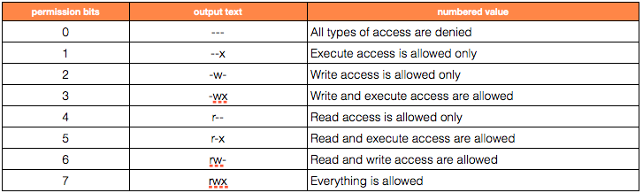

# General Documentation

*The Linux Documentation Project is a resource for basically everything.*

https://www.tldp.org/

# Filesystem Hierarchy

https://www.tldp.org/LDP/Linux-Filesystem-Hierarchy/html/foreward.html

# File Permissions

[Permissions Visual / Calculator](http://www.filepermissions.com/)

*Quick Cheat Sheet:*

# Git

[Simple Setup](https://githowto.com/setup)

[Beginner Guide](https://stackoverflow.com/questions/315911/git-for-beginners-the-definitive-practical-guide?rq=1)

[Git Explanation](https://rachelcarmena.github.io/2018/12/12/how-to-teach-git.html)

### Branching Strategies

[Release Flow](https://docs.microsoft.com/en-us/azure/devops/learn/devops-at-microsoft/release-flow)

[Git Flow](http://nvie.com/posts/a-successful-git-branching-model/)

[Github Flow](https://guides.github.com/introduction/flow/)

[Gitlab Flow](https://about.gitlab.com/2014/09/29/gitlab-flow/)

[Bitbucket Flow](https://www.atlassian.com/blog/archives/simple-git-workflow-simple)

### Trunk Based Development

https://trunkbaseddevelopment.com/

https://www.infoq.com/news/2018/04/trunk-based-development/ (5min read)

### Trunk Based vs. Git Flow

[Trunk vs GitFlow](https://www.toptal.com/software/trunk-based-development-git-flow) (5min read)

### Rebase

[Rebase In-Depth](https://git-rebase.io/) (15-20min read)

### Video Guides

[Advanced Git Usage](https://www.youtube.com/watch?v=0SJCYPsef54)

# RPM

[RPM Package Database](https://rpmfind.net/linux/rpm2html/search.php?query=&submit=Search+...&system=&arch=)

# Shell Scripting

*Shell Script Styling:*

[Bash Style Guide (Google)](https://google.github.io/styleguide/shell.xml)

*Shell Script Debugging:*

[Explain Shell](https://explainshell.com/)

[Shell Check](https://www.shellcheck.net/)

*Shell Scripting Resources:*

http://www.shelldorado.com/

# TTY

[The TTY Demystified](https://www.linusakesson.net/programming/tty/)

# /dev/random

*Myths:*
https://www.2uo.de/myths-about-urandom

# gsettings

*Get a listing of all gsettings; grep to find*

`gsettings list-recursively`

`gsettings list-recursively | grep www`

# apt

[Why does apt not use HTTPS?](https://whydoesaptnotusehttps.com/)

# pushd; popd

https://agilesysadmin.net/understanding-pushd-and-popd/

# tar

[Basic Introduction](https://linuxacademy.com/blog/linux/the-tar-command-bash-basics/)

# Blogs

[Linux Inside](https://0xax.gitbooks.io/linux-insides/)
- A look into the Linux kernel.

# DevOps

['Getting into DevOps' thread 2019 - Reddit](https://www.reddit.com/r/devops/comments/bvqyrw/monthly_getting_into_devops_thread_201906/)

## Introduction
[What is DevOps? - 10min read](https://aws.amazon.com/devops/what-is-devops/)

## Roadmap

[DevOps Roadmap - GitHub](https://github.com/kamranahmedse/developer-roadmap#devops-roadmap)

## Books

[Site Reliability Engineering - Google](https://landing.google.com/sre/books/)
